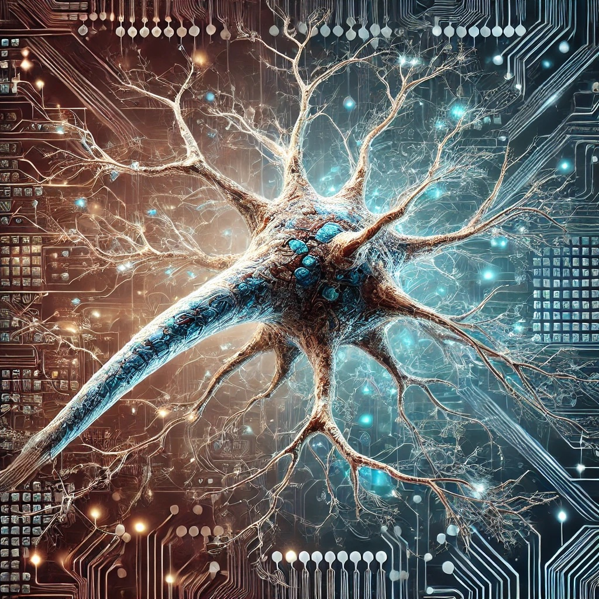

# Memory Transfer Revolution

## Introduction 🧠

Imagine a world where the boundaries of human experience are not limited by the confines of a single lifetime. A world
where the memories, knowledge, and essence of a person can transcend the physical limitations of their body. This
project presents to you an extraordinary vision that will revolutionize humanity's understanding of life and memory: the
ability to transfer consciousness and memories into another body.

## Why This Matters 🤔

The advancements in memory transfer technology promise revolutionary applications in various domains. In medicine, it
offers the potential to transfer consciousness from patients with degenerative diseases or severe injuries to healthy
bodies, granting them a new lease on life. It can preserve the wisdom of our greatest minds, ensuring their invaluable
insights continue to inspire future generations. Memory transfer also provides comfort to families by allowing the
essence of loved ones to persist, maintaining their memories and personalities intact.
[Potential applications](docs/concept-and-vision/potential-applications.md#potential-applications) extend beyond these
immediate benefits, encompassing enhanced cognitive abilities, collective intelligence, therapeutic solutions,
human-computer symbiosis, and profound impacts on virtual reality and cultural preservation.

## Vision and Mission 🎯

- **VISION** - is to create a future where human experiences are preserved and enhanced beyond the limits of our
  physical bodies.
- **MISSION** - is to research, develop, and implement groundbreaking technologies that enable memory transfer, ensuring
  these advancements are accessible, ethical, and beneficial to all.

---

- [Quick Overview](docs/articles/10-minutes-summary.md) (5-10 minutes of reading)

---

## Table of Contents

- **Introduction**
    - [Overview](docs/introduction/overview.md)
- **Concept and Vision**
    - [Potential Applications](docs/concept-and-vision/potential-applications.md)
    - [Ethical and Societal Implications](docs/concept-and-vision/ethical-and-societal-implications.md)
- **Implementation Strategy**
    - [Project Phases and Milestones](docs/implementation-strategy/project-phases-and-milestones.md)
    - [Resource Allocation and Management](docs/implementation-strategy/resource-allocation-and-management.md)
    - [Detailed Timelines and Roadmaps](docs/implementation-strategy/detailed-timelines-and-roadmaps.md)
- **Partnerships and Collaborations**
    - [Academic and Research Institutions](docs/partnerships-and-collaborations/academic-and-research-institutions.md)
    - [Corporate Partnerships](docs/partnerships-and-collaborations/corporate-partnerships.md)
    - [Philanthropic Organizations](docs/partnerships-and-collaborations/philanthropic-organizations.md)
- **Research and Development**
    - [Initial Research and Findings](docs/research-and-development/initial-research-and-findings.md)
- **Scientific Background**
    - [Existing Research and Technologies](docs/scientific-background/existing-research-and-technologies.md)
    - [Neuroscience of Memory](docs/scientific-background/neuroscience-of-memory.md)
- **Ethical Considerations**
    - [Ethical Framework and Guidelines](docs/ethical-considerations/ethical-framework-and-guidelines.md)
    - [Privacy and Consent](docs/ethical-considerations/privacy-and-consent.md)
    - [Regulatory Compliance](docs/ethical-considerations/regulatory-compliance.md)
- **Public Engagement and Awareness**
    - [Community Building and Engagement](docs/public-engagement-and-awareness/community-building-and-engagement.md)
    - [Educational Outreach](docs/public-engagement-and-awareness/educational-outreach.md)
    - [Marketing and PR Strategies](docs/public-engagement-and-awareness/marketing-and-pr-strategies.md)
